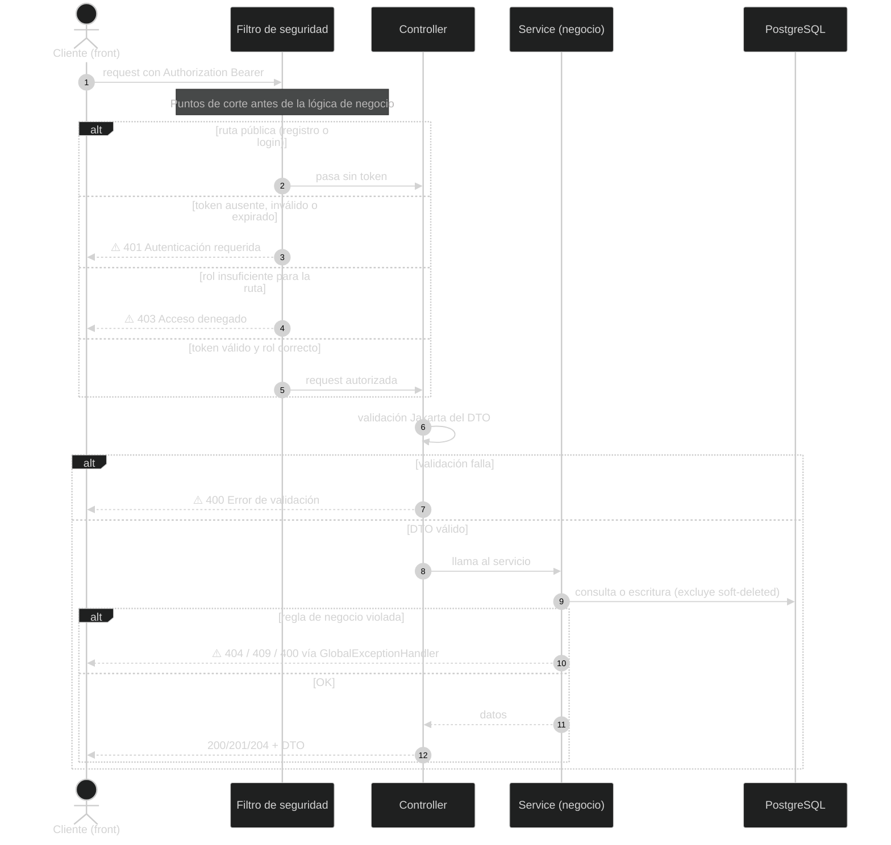
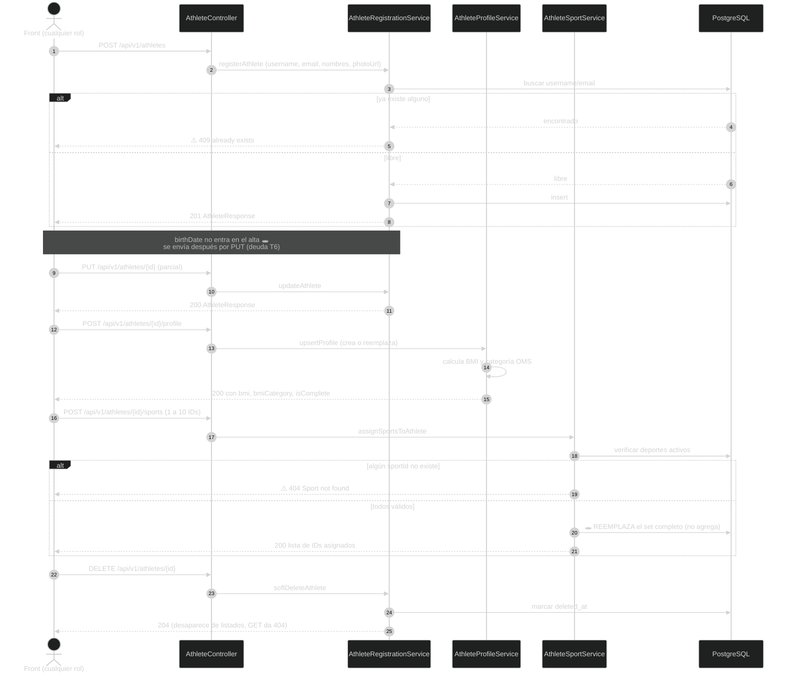
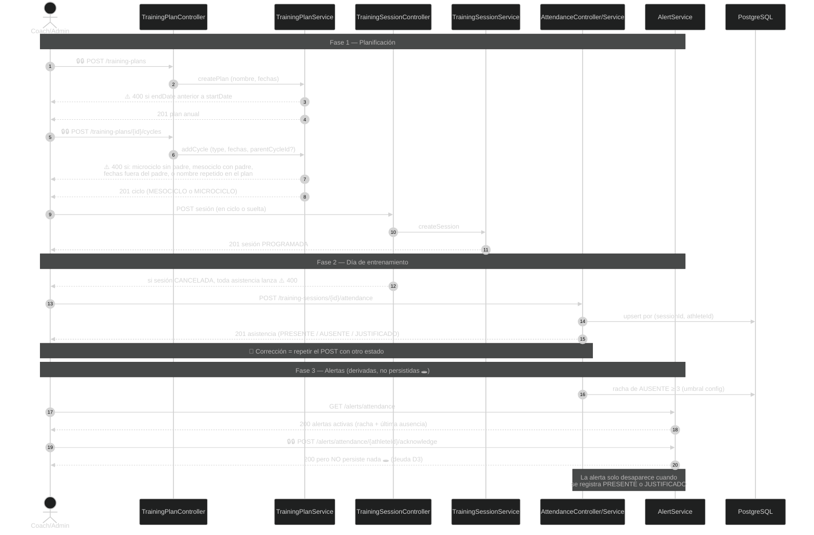
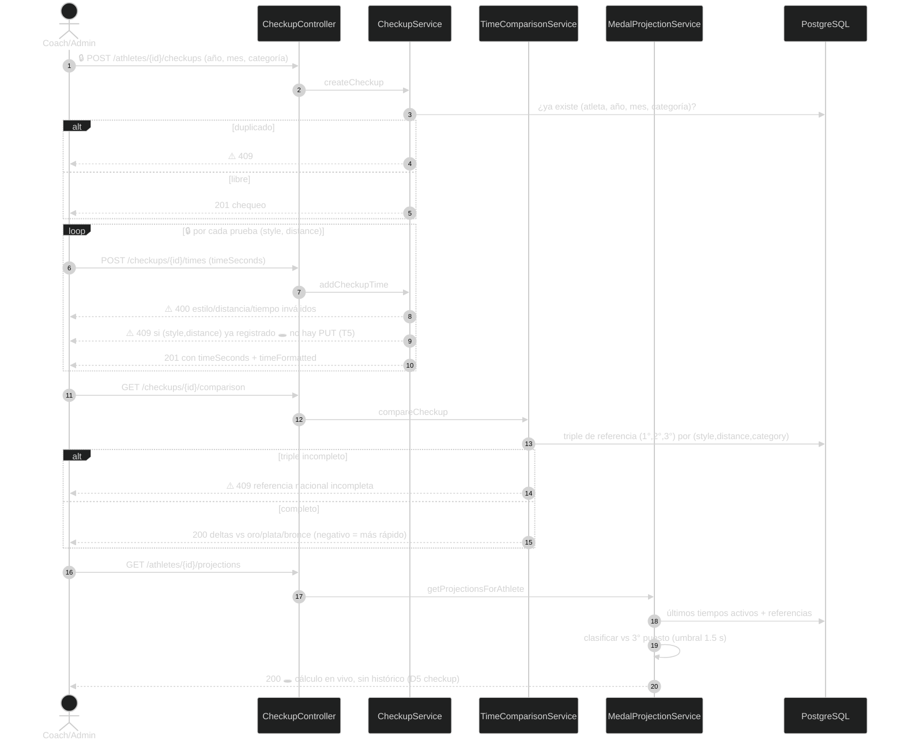
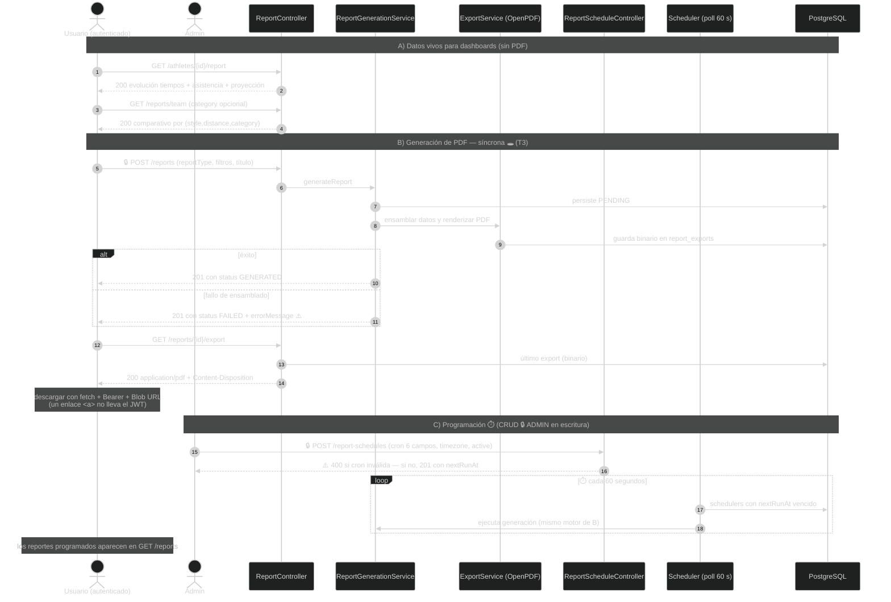

# AthleteCore — Flujo completo del sistema (diagramas)

> Estado **actual y verificado contra el código** (`develop` @ `293f0dd`, vía CodeGraph).
> 6 diagramas de secuencia: el 1 es la vista general; 2–6 detallan cada subsistema.
> Documentación de apoyo: `docs/frontend-handoff/` (00–09) en el repo del backend.
>
> **Leyenda:** ⚠️ rama de error · ⏱️ proceso programado · 🔒 restricción de rol ·
> 🕳️ comportamiento marcado como deuda técnica.

---

## 1. Vista general: anatomía de una request

**Notas:**
- Stateless total: sin sesiones, cookies ni CSRF; cada request se valida de cero (ver `02`).
- El filtro de soft delete (`deleted_at IS NULL`) está en JPA: ningún borrado lógico es
  visible en ningún paso posterior.
- Los errores llegan al front siempre con el mismo shape `ErrorResponse`, incluso los
  401/403 del filtro (ver `08` §1–2).
- Toda respuesta exitosa es un DTO recortado: el front nunca ve la entidad (ver `00` §4).

---

## 2. Autenticación y ciclo de vida de la sesión

```mermaid
%%{init: {'theme': 'dark'}}%%
sequenceDiagram
    autonumber
    actor U as Usuario
    participant F as Front
    participant L as AuthController
    participant J as AuthService + JwtService
    participant API as Endpoints protegidos

    U->>F: usuario y contraseña
    F->>L: POST /api/v1/auth/login
    L->>J: authenticate y generar token
    alt credenciales incorrectas o usuario inexistente
        J-->>F: ⚠️ 401 Credenciales inválidas (mismo mensaje en ambos casos)
    else autenticado
        J-->>F: 200 con token, expiresIn (24 h) y user
        Note over F: Token HS256 con claims sub, userId, roles, iat, exp.<br/>Sin refresh, sin logout, sin /me 🕳️
        loop cada llamada posterior
            F->>API: Authorization Bearer (token)
            alt token vigente
                API-->>F: 200/201/204 + DTO
            else expirado (24 h por defecto)
                API-->>F: ⚠️ 401 Autenticación requerida
                F->>U: 🕳️ re-login obligatorio (decisión D1)
            end
        end
    end
```

**Notas:**
- La sesión del lado del front vive en el token: "quién soy" = decodificar `sub`,
  `userId`, `roles` del JWT, o el objeto `user` guardado del login (ver `03` §2).
- El mensaje 401 del login es deliberadamente ambiguo (anti-enumeración): el front no debe
  intentar distinguir "usuario no existe" de "password incorrecta".
- `401` → redirigir a login. `403` → pantalla de sin permisos. Nunca mezclarlos (ver `02` §5).
- Registro (`POST /api/v1/users`) es público pero no encadena login: crea siempre con
  `ROLE_USER` y el usuario debe loguearse después (ver `03` §3, §6).

---

## 3. Deportistas: ciclo de vida de un atleta

**Notas:**
- `GET /api/v1/athletes` es el **único listado paginado** de la API (`page/size/sort`,
  shape `Page` de Spring — ver `04` §2).
- La ficha completa de un atleta requiere 3–4 llamadas: detalle + perfil (tolerar 404 =
  "sin perfil") + sports + catálogo `GET /api/v1/athletes/sports` (cacheable, ver `04` §5).
- El BMI y su categoría se calculan **en el servidor**; el front solo los muestra, nunca
  los recalcula.
- La foto es solo una URL en `photoUrl`: no hay subida de archivos (decisión D5 pendiente).

---

## 4. Entrenamientos: planificación, asistencia y alertas

🔒 Todo este módulo exige rol **ADMIN o COACH**. Las escrituras marcadas 🔒🔒 son solo ADMIN.

**Notas:**
- `GET /training-plans/{id}` devuelve el árbol mesociclo→microciclo ya montado y ordenado
  (por `orderIndex`, luego fecha): el front no re-ensambla (ver `05` §2).
- El pase de lista se arma cruzando `GET /training-sessions/{id}` (trae la asistencia
  registrada) con el catálogo de atletas; quien no está marcado simplemente no aparece.
- Sesiones pueden existir sin ciclo (sueltas) y opcionalmente con `disciplineId` — pero
  las disciplinas no tienen endpoint de consulta (decisión D4 pendiente).
- El acknowledge es el único endpoint "falso mutante" de la API: tratarlo como acción
  visual/local hasta que el back lo persista (ver `09` D3).

---

## 5. Chequeos: del tiempo registrado a la proyección de medalla

**Notas:**
- Prerequisito oculto de todo el módulo: la **tabla nacional** (`/national-reference-times`,
  CRUD 🔒 ADMIN) debe tener triples completos por combinación; si falta una posición, la
  comparación responde 409 — el front debe mostrar "referencia incompleta", no error (ver
  `06` §2–3).
- Tiempos siempre en doble formato: enviar `timeSeconds` (número), mostrar `timeFormatted`
  ("mm:ss.fff") tal cual (ver `06` §1).
- Clasificaciones posibles: `POR_ENCIMA_DEL_PODIO`, `CERCANO_A_MEDALLERIA`,
  `FUERA_DE_RANGO` (el umbral de 1.5 s es configurable en el servidor).
- Corregir un tiempo = borrar el chequeo y recrearlo; no existe edición (deuda T5).

---

## 6. Reportes: JSON vivo, PDF síncrono y scheduler

**Notas:**
- La generación responde 201 aunque falle por dentro: el front debe **leer `status`**
  (`GENERATED`/`FAILED`) en vez de asumir éxito por el 201 (ver `07` §3).
- El ciclo es síncrono hoy (PENDING→final dentro de la request); diseñar la UI con
  spinner + lectura de `status` deja lista la transición a async futuro.
- La expresión cron es de **6 campos (Spring)**, no la de 5 de Unix: la UI debería
  ocultarla tras presets y mostrar `nextRunAt` como confirmación.
- Los PDF se persisten como BYTEA en la base de datos (no hay S3/disco).

---

*Generado: 2026-09-06 · Fuente: código de `develop` verificado vía CodeGraph.*
